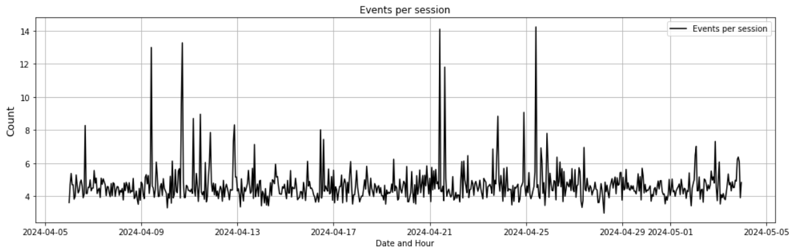
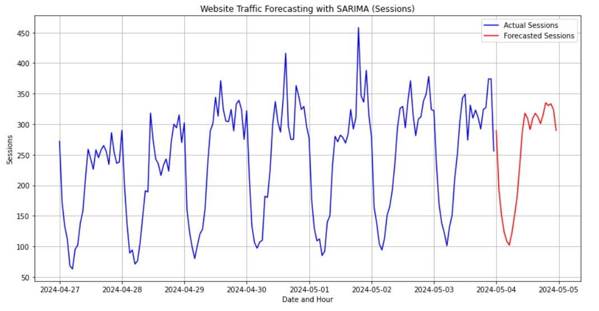

# Website Performance Analysis
 This project provides a comprehensive analysis of website performance. We will be analyzing various important metrics like a website's functionality, user engagement, and overall success in achieving the business goal. It will helps the business owners to know their user behavior and also help the owners to the conversion rates and get an understanding of how is the user experience and make the necessary changes.

After loading the data, we have explore it or perform an EDA(Exploratory Data Analysis) to understand our data, which is the crucial step.

## 1. Check the datatypes:

The **Date + hour (YYYYMMDDHH)** column is in int64 format and is concatenated as an integer we need it in an appropriate data format, so we need to change it.

## 2. Check for NULL values:

We don't have any missing values, so we can move forward.

## 3. Total Users and Sesssions Over Time:

This chart represents the overall trend of the users (the unique counts) and the sessions (total number of visits) througout
different time interval. Both of them seems to follow a regular pattern while some peaks on the sessions can be seen 
on some specific time period.

## 4. User Engagement Analysis:

These chart helps us to get an insight on how the customers or the visitors interact with our website.

**1. Total Engaged Sessions:** These are the total sessions that the website had on a particular date. If we see the chart, there is a consistent pattern and only 3 of the dates has the top spikes, two of them being at 2024-04-18 and 2024-04-19 and the other being almost at the end of the month of April. There could have been some offers for stock clearence or some sale going on, due to which these particular days at the highest number of sessions.

**2. Average Engagement Timer Per Session:** Compared to the total engaged session, there is just one noticeable peaks in the pattern which is a bit surprising since the count and the average time spent should have some correlation but still we cannot be biased, we will look into the correlation in the next section of analysis.

**3. Engaged Sessions Per User:** The ratio in this chart seems to fluctuate slightly but generally indicates a good portion of sessions per use are engaged. These peaks in the chart could correspond to the times when the user found good contents or items which was more relevant or engaging.

**4. Events Per Session:** The number of events during each session is mostly stable but does vary a bit. Spikes in this number might mean visitors are interacting more with the content or features.

**5. Engagement Rate:** The engagement rate shows how many sessions are actively engaged out of all sessions. There are some fluctuations, which could be due to how well the content connects with users or how successful certain ways of attracting users are.

## 5. Correlation between the User Engagement Features:

**1. Avg Engagement Time Vs Events/Sessions:** Most of the values are clustered in the lower regions i.e. most of the events were occurent when the average engagement time of the users were around <= 800. An increment in engagement time doesn't necessarily increases the events. As we see in the chart although the average engagement time had increased the events that occured were still below certain threshold. So, most of the events happen when the average user engagement is low.

**2. Avg Engagement Time Vs Engagement Rate:** Sessions with very short engagement times have varying engagement rates, but as time increases, engagement rates generally go up.

**3. Engaged Sessions Per User Vs Events Per Session:** Most users have low values for both engaged sessions and events per session, with only a few showing high numbers.

**4. Engaged Sessions Per User Vs Engagement Rate:** There is a strong positive correlation between them. As the engaged sessions increases for the user so does the engagement rate.

## 6. Channel Performance Analysis:

The data reveals notable differences in performance across various channels, showcasing each one's strengths and weaknesses in generating traffic, engaging users, and prompting interactions. 'Organic Search' excels in driving traffic but shows lower engagement and event metrics, indicating a focus on quantity rather than quality of visits. On the other hand, 'Referral' and 'Organic Video' channels, although not the highest in volume, are particularly effective in deeply engaging users, suggesting opportunities to capitalize on these strengths in marketing strategies.

## 7. Forecasting Website Traffic:

**1. PACF (Partial Autocorrelation Function):** This plot helps determine the p parameter for the AR part of the model. You look for the lag after which most partial autocorrelations are not significantly different from zero. In our plot, the PACF shows a significant spike at lag 1 and then cuts off, suggesting an AR part of order 1. Therefore, p=1.

**2. ACF (Autocorrelation Function):** This plot helps identify the q parameter for the MA part of the model. You look for the lag after which most autocorrelations are not significantly different from zero. The ACF plot in our case tails off gradually, but considering the first significant spike is essential. Since the spike at lag 1 is significant and there’s a gradual tailing off rather than a sharp cut-off, it suggests a potential MA component. However, the tailing-off nature complicates the exact determination of q, but a starting point of q=1 could be considered.

 

**Plotting the forecast for the next 24-hours:** 
  

